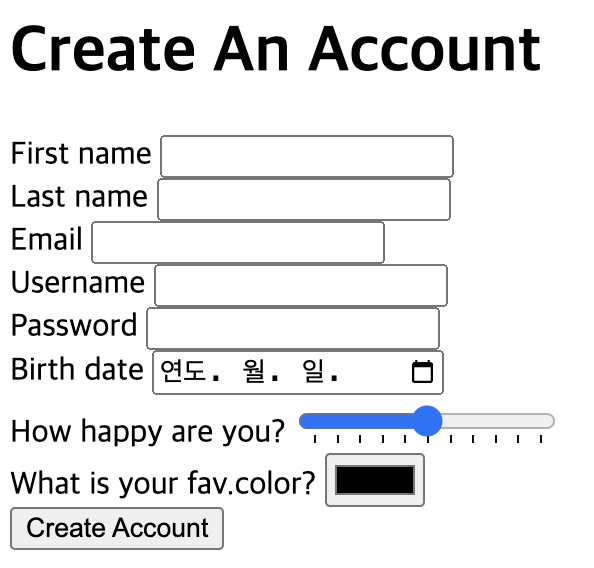
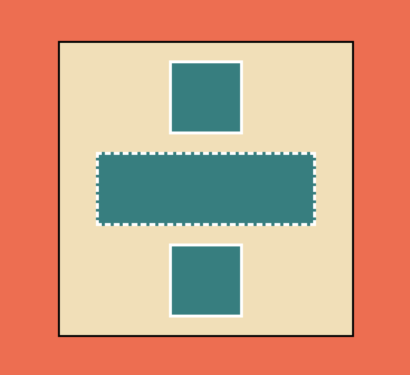
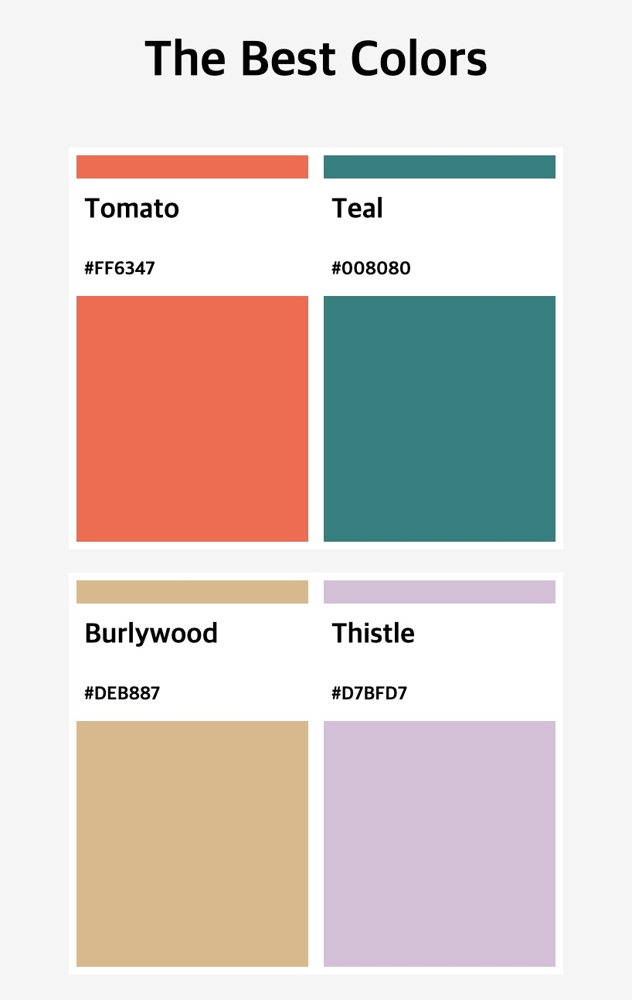
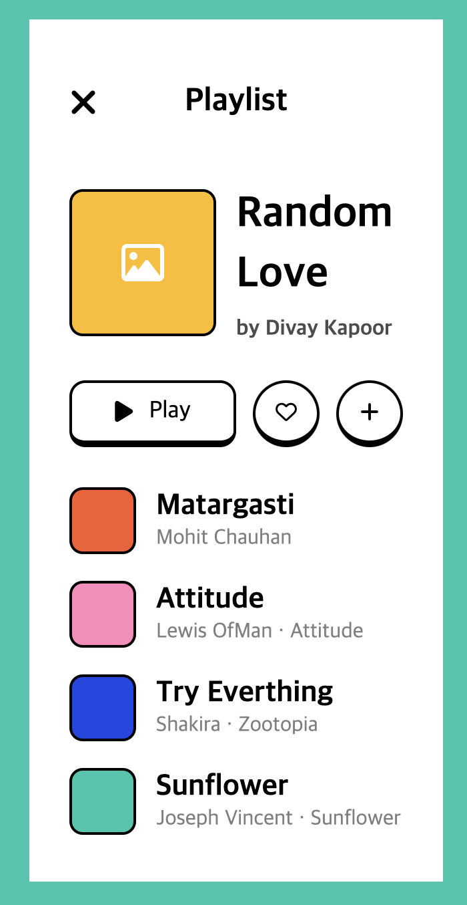
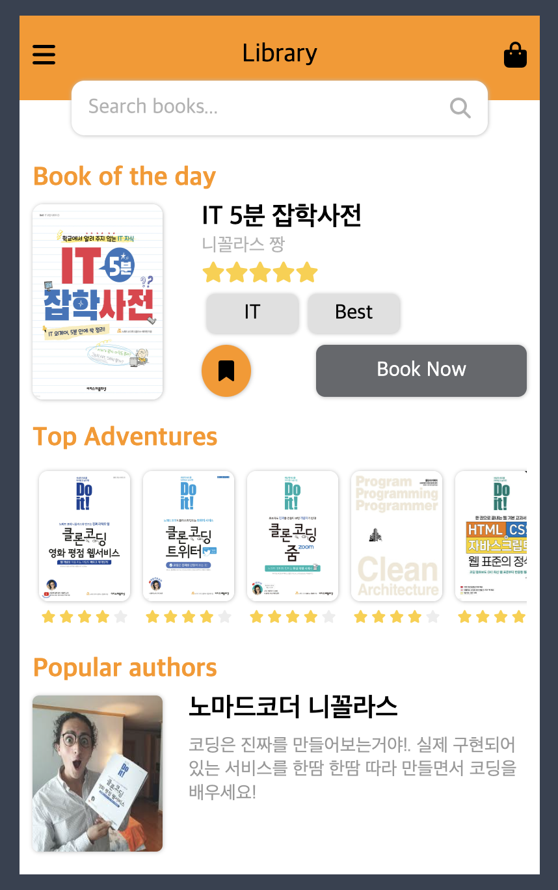
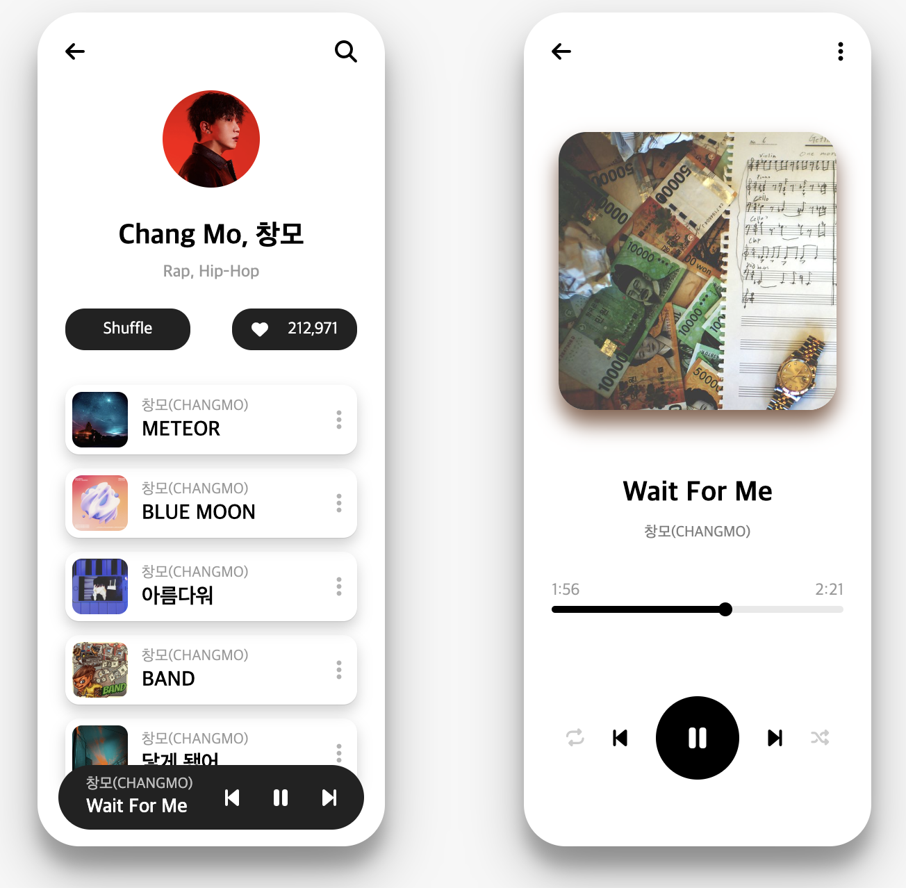

# 프로젝트 이름

IZ\*ONE-Talk

## 소개

이 프로젝트는 HTML과 CSS를 사용하여 카카오톡을 클론코딩 한 것입니다. 이 프로젝트를 통해 HTML과 CSS의 기본 개념과 웹 페이지 레이아웃 기술을 학습하였습니다.

## 수상

- 🏆우수 작품상 수상🏆(https://nomadcoders.co/community/thread/10065)

## 사용 기술

- HTML5
- CSS3

## 배포 사이트

- https://cheoljunpark.github.io/izone-talk

## 파일 구조

```shell
izone-talk/
├── README.md
├── assets
│   ├── assignment
│   ├── chat
│   ├── find
│   ├── friends
│   └── more
├── css
│   ├── components
│   ├── reset.css
│   ├── screens
│   ├── styles.css
│   └── variable.css
├── chat.html
├── chats.html
├── find.html
├── friends.html
├── index.html
├── more.html
└── settings.html
```

## 추가 HTML & CSS 연습 결과물

- https://replit.com/@cheoljunpark/YouAreAwesomeBlueprint#index.html<br>
  
- https://replit.com/@cheoljunpark/YouAreAwesomeBlueprint-1<br>
  
- https://replit.com/@cheoljunpark/kokoa-cloneassignment07<br>
  
- https://replit.com/@dkfnak6789/kokoa-cloneassignment08<br>
  
- https://replit.com/@dkfnak6789/kokoa-cloneassignment09<br>
  
- https://replit.com/@dkfnak6789/kokoa-cloneassignmentten<br>
  
- https://replit.com/@dkfnak67891/kokoa-cloneassignment11<br>
  
