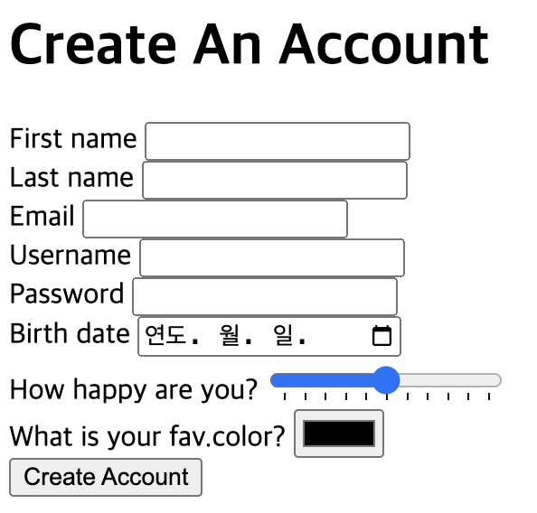
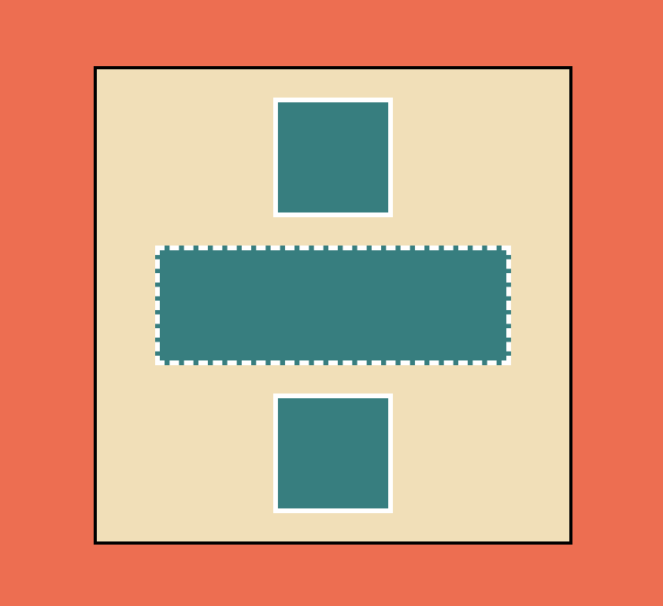
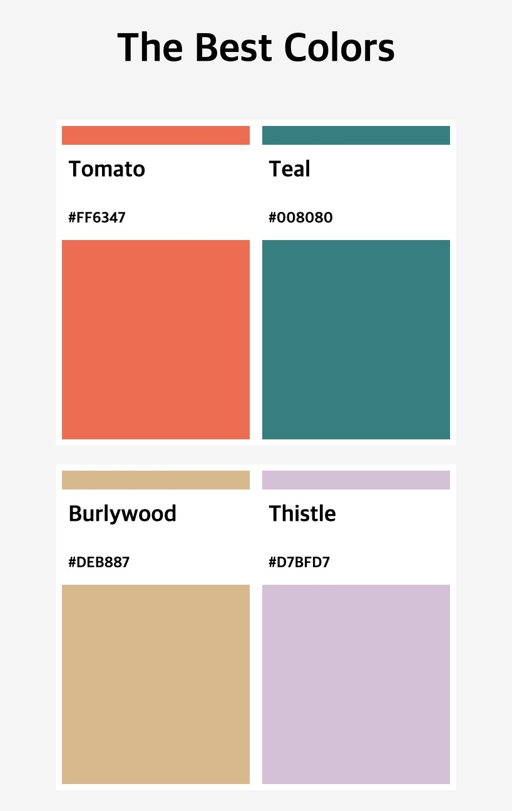
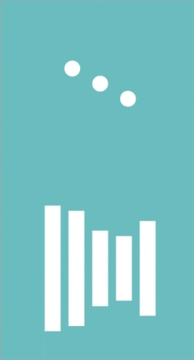
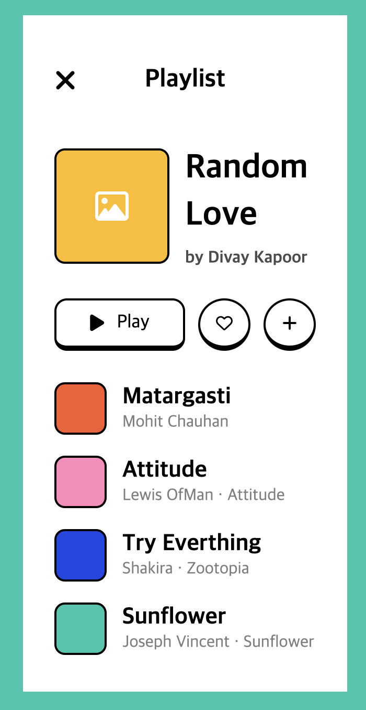
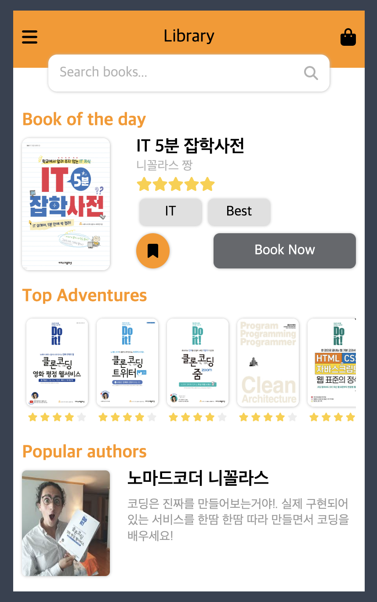
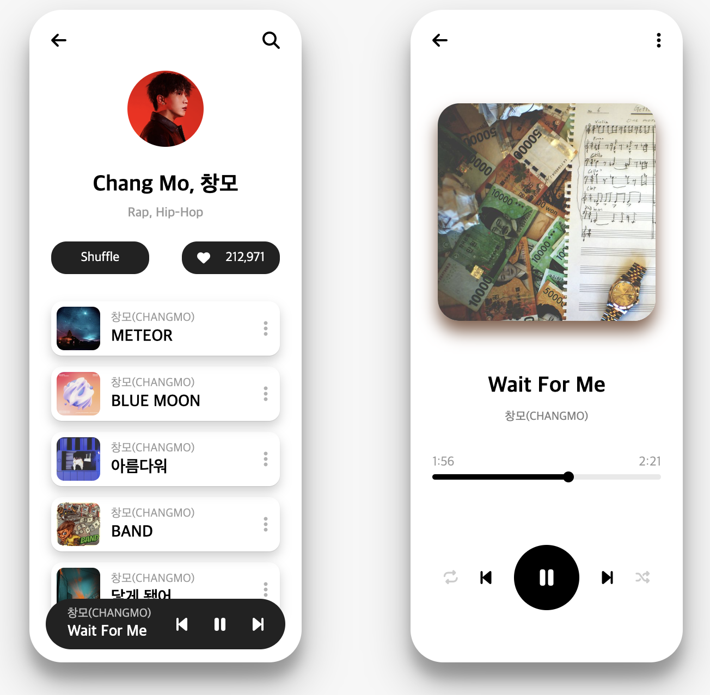

# 프로젝트 이름

IZ\*ONE-Talk

## 소개

이 프로젝트는 HTML과 CSS를 사용하여 카카오톡을 클론코딩 한 것입니다. 이 프로젝트를 통해 HTML과 CSS의 기본 개념과 웹 페이지 레이아웃 기술을 학습하였습니다.

## 사용 기술

- HTML5
- CSS3

## 배포 사이트

- https://cheoljunpark.github.io/izone-talk

## 파일 구조

```plaintext
izone-talk/
├── chat.html
├── chats.html
├── find.html
├── friends.html
├── index.html
├── more.html
├── settings.html
├── css/
│   └── reset.css
│   └── styles.css
│   └── variable.css
│   └── components/
│       └── footer-menu.css
│       └── header.css
│       └── settings-header.css
│       └── status-bar.css
│   └── screens/
│       └── chat.css
│       └── chats.css
│       └── find.css
│       └── friends.css
│       └── login.css
│       └── more.css
│       └── settings.css
└── assets/
    └── (이미지 파일들)
└── screenshots/
    └── (클론코딩 이미지 파일들)
```

## 추가 HTML & CSS 연습 결과물

- https://replit.com/@cheoljunpark/YouAreAwesomeBlueprint#index.html
  
- https://replit.com/@cheoljunpark/YouAreAwesomeBlueprint-1
  
- https://replit.com/@cheoljunpark/kokoa-cloneassignment07
  
- https://replit.com/@dkfnak6789/kokoa-cloneassignment08
  
- https://replit.com/@dkfnak6789/kokoa-cloneassignment09
  
- https://replit.com/@dkfnak6789/kokoa-cloneassignmentten
  
- https://replit.com/@dkfnak67891/kokoa-cloneassignment11
  
